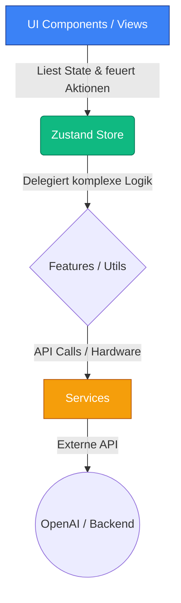

# BrainDump PWA

Eine KI-gestützte Progressive Web App (PWA) zur Strukturierung von alltäglichen Gedanken, Aufgaben und Notizen. 

## 🛠 Tech Stack
- **Framework:** React 18
- **Build Tool:** Vite
- **Sprache:** TypeScript
- **Styling:** Tailwind CSS (v4)
- **State Management:** Zustand

## 🚀 Lokales Setup
1. Repository klonen: `git clone [DEINE_REPO_URL]`
2. Abhängigkeiten installieren: `npm install`
3. Entwicklungsserver starten: `npm run dev`

## 🏗 Architektur (Feature-Sliced Design)
Die Anwendung folgt einer strikten Trennung der Zuständigkeiten (Single-Responsibility-Prinzip).



## 📝 Git Commit Conventions

### Regeln

- Imperativ verwenden („add" statt „added")
- Kleinschreibung
- Kein Punkt am Ende
- 1 Commit = 1 Änderung
- Leerzeile zwischen Beschreibung und Body/Footer

### Format

```
<type>(<scope>): <beschreibung>
```

### Commit-Typen

| Typ        | Bedeutung                              |
| ---------- | -------------------------------------- |
| `feat`     | Neue Funktion                          |
| `fix`      | Bug behoben                            |
| `refactor` | Code umgebaut (kein Feature, kein Bug) |
| `test`     | Tests hinzugefügt oder angepasst       |
| `style`    | Formatierung, Whitespace               |
| `docs`     | Nur Dokumentation                      |
| `chore`    | Dependencies, Configs                  |
| `ci`       | CI/CD-Pipeline                         |

### Breaking Changes

```
<type>(<scope>)!: <beschreibung>
```

Wenn eine Änderung die öffentliche API bricht (semantische Versionierung → Major-Bump), muss das markiert werden:

- **Kurzform:** `!` nach dem Typ/Scope, z. B. `feat(api)!: remove deprecated endpoints`
- **Langform:** Footer mit `BREAKING CHANGE: <erklärung>`

Beide Varianten dürfen kombiniert werden — der Footer beschreibt dann das Detail.

### Beispiele

**Standard-Feature:**

```
feat(inventory): add delete confirmation modal

Closes #42
```

**Bugfix mit Referenz:**

```
fix(auth): prevent token refresh race condition

Refs #87
```

**Breaking Change:**

```
feat(api)!: remove deprecated v1 endpoints

BREAKING CHANGE: clients using /api/v1/* must migrate to /api/v2/*.
See migration guide in docs/migration-v2.md.

Closes #103
```

**Tests:**

```
test(inventory): cover edge cases for stock calculation
```