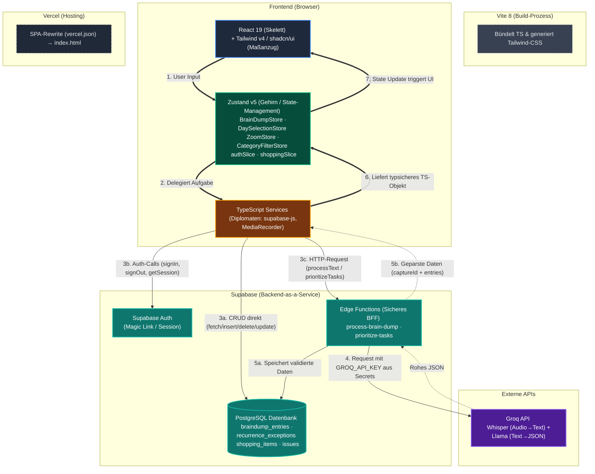

```mermaid
flowchart TD
    %% Tooling Phase
    subgraph Tooling ["Vite 8 (Build-Prozess)"]
        V[Bündelt TS & generiert Tailwind-CSS]
    end

    %% Client Layer (Browser)
    subgraph Client ["Frontend (Browser)"]
        direction TB
        UI["React 19 (Skelett) <br/> + Tailwind v4 / shadcn/ui (Maßanzug)"]
        Store["Zustand v5 (Gehirn / State-Management) <br/> BrainDumpStore · DaySelectionStore <br/> ZoomStore · CategoryFilterStore <br/> authSlice · shoppingSlice"]
        Services["TypeScript Services <br/> (Diplomaten: supabase-js, MediaRecorder)"]

        UI == "1. User Input" ==> Store
        Store == "7. State Update triggert UI" ==> UI

        Store == "2. Delegiert Aufgabe" ==> Services
        Services == "6. Liefert typsicheres TS-Objekt" ==> Store
    end

    %% Cloud Backend (Supabase)
    subgraph BaaS ["Supabase (Backend-as-a-Service)"]
        direction TB
        Auth["Supabase Auth <br/> (Magic Link / Session)"]
        Edge["Edge Functions (Sicheres BFF) <br/> process-brain-dump · prioritize-tasks"]
        DB[("PostgreSQL Datenbank <br/> braindump_entries · recurrence_exceptions <br/> shopping_items · issues")]
    end

    %% External APIs
    subgraph External ["Externe APIs"]
        KI["Groq API <br/> Whisper (Audio→Text) + Llama (Text→JSON)"]
    end

    %% Deployment
    subgraph Deploy ["Vercel (Hosting)"]
        SPA["SPA-Rewrite (vercel.json) → index.html"]
    end

    %% Verbindungen
    Services -- "3a. CRUD direkt (fetch/insert/delete/update)" --> DB
    Services -- "3b. Auth-Calls (signIn, signOut, getSession)" --> Auth
    Services -- "3c. HTTP-Request (processText / prioritizeTasks)" --> Edge
    Edge -- "4. Request mit GROQ_API_KEY aus Secrets" --> KI
    KI -. "Rohes JSON" .-> Edge
    Edge -- "5a. Speichert validierte Daten" --> DB
    Edge -. "5b. Geparste Daten (captureId + entries)" .-> Services

    %% Farben und Styling
    classDef frontend fill:#1e293b,stroke:#3b82f6,stroke-width:2px,color:#fff
    classDef state fill:#064e3b,stroke:#10b981,stroke-width:2px,color:#fff
    classDef service fill:#78350f,stroke:#f59e0b,stroke-width:2px,color:#fff
    classDef supabase fill:#0f766e,stroke:#14b8a6,stroke-width:2px,color:#fff
    classDef ki fill:#4c1d95,stroke:#8b5cf6,stroke-width:2px,color:#fff
    classDef tooling fill:#374151,stroke:#9ca3af,stroke-width:1px,color:#e5e7eb,stroke-dasharray: 5 5
    classDef deploy fill:#1f2937,stroke:#6b7280,stroke-width:1px,color:#e5e7eb,stroke-dasharray: 5 5

    class UI frontend
    class Store state
    class Services service
    class Auth,Edge,DB supabase
    class KI ki
    class V tooling
    class SPA deploy
```
