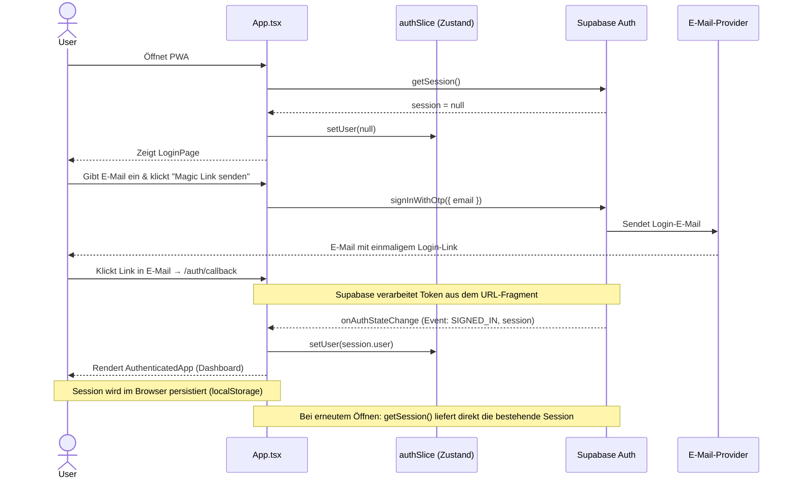
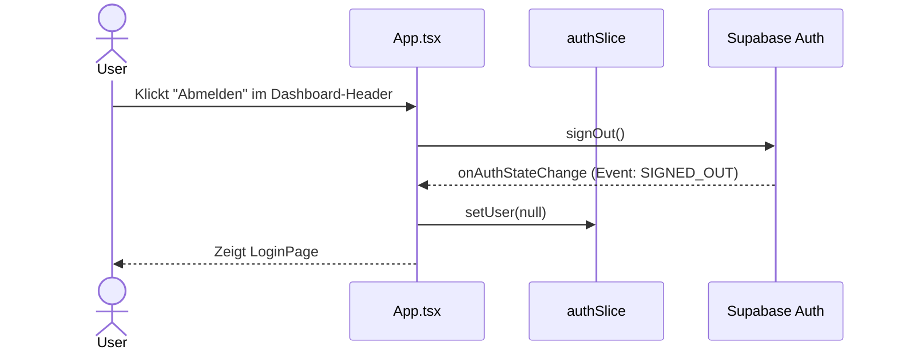

# Auth-Flow (Magic Link)

BrainDump nutzt Supabase Magic Links — kein Passwort, kein OAuth. Der User bekommt eine E-Mail mit einem Einmal-Link und ist danach dauerhaft eingeloggt bis zur expliziten Abmeldung.

## Ablauf

## Abmeldung

## Schlüsseldateien

| Datei | Rolle |
| :--- | :--- |
| `src/App.tsx` | Root-Komponente: `getSession()` + `onAuthStateChange`-Listener |
| `src/store/authSlice.ts` | Hält `user: User \| null` global im Zustand-Store |
| `src/services/auth/authService.ts` | Kapselt `signInWithOtp` und `signOut` |
| `src/features/auth/views/LoginPage.tsx` | UI: E-Mail-Eingabe, Magic-Link-Versand |
