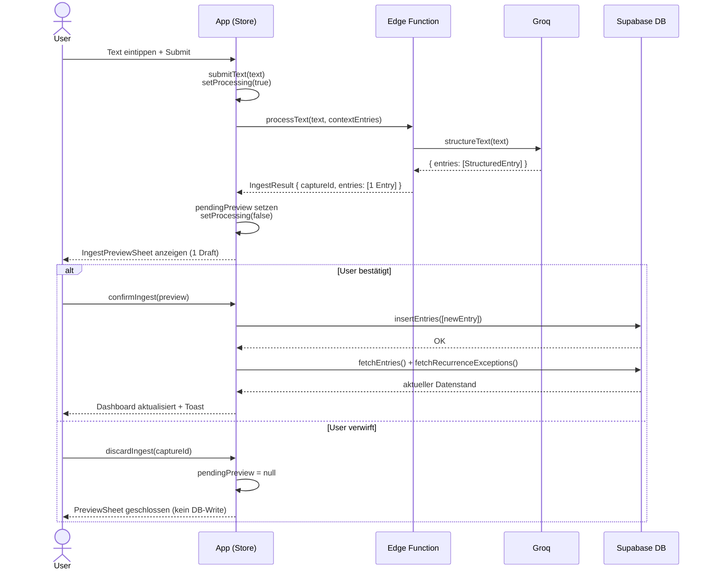

# Dump-Flow A — Text → 1 Entry → Confirm

Basis-Flow: User tippt Text, LLM gibt einen einzigen Entry zurück (TASK, EVENT oder NOTE),
User bestätigt oder verwirft im Preview.

**Akteure:**
- **User** — Browser
- **App** — Frontend (BrainDumpStore + React)
- **EdgeFn** — Supabase Edge Function `process-brain-dump`
- **Groq** — LLM (Llama, JSON-Mode)
- **DB** — Supabase PostgreSQL

**Hinweise:**
- `contextEntries` sind bestehende Nicht-NOTE-Entries, die der LLM als Kontext bekommt,
  um Zusatzinfos korrekt einem vorhandenen Entry zuzuordnen (relevant für Fall D).
- Der `captureId` ist eine UUID, die alle Entries eines Dumps zusammenhält.
  Bei Fall A gibt es nur einen Entry unter dieser ID.
- Der Preview-Schritt ist immer vorhanden — kein direktes Speichern ohne User-Bestätigung
  (Manuell first).

## Referenzen

| Name im Diagramm | Funktion / Datei | Pfad |
| :--- | :--- | :--- |
| `submitText` | Store-Action: Text verarbeiten, Preview setzen | `src/features/braindump/store/BrainDumpStore.ts` |
| `processText` | HTTP-Call zur Edge Function | `src/features/braindump/services/processBrainDump.ts` |
| `structureText` | Groq-Aufruf + JSON-Parsing | `supabase/functions/process-brain-dump/structureText.ts` |
| Edge Function | Entry-Verarbeitung via Groq | `supabase/functions/process-brain-dump/index.ts` |
| `IngestPreviewSheet` | Bottom Sheet mit Entwurfs-Karten | `src/features/braindump/views/IngestPreviewSheet.tsx` |
| `confirmIngest` | Store-Action: Entwürfe in DB schreiben | `src/features/braindump/store/BrainDumpStore.ts` |
| `insertEntries` | DB-Insert für neue Entries | `src/features/braindump/services/index.ts` |
| `fetchEntries` | Entries nach Save neu laden | `src/features/braindump/services/index.ts` |
| `discardIngest` | Store-Action: Preview verwerfen | `src/features/braindump/store/BrainDumpStore.ts` |
