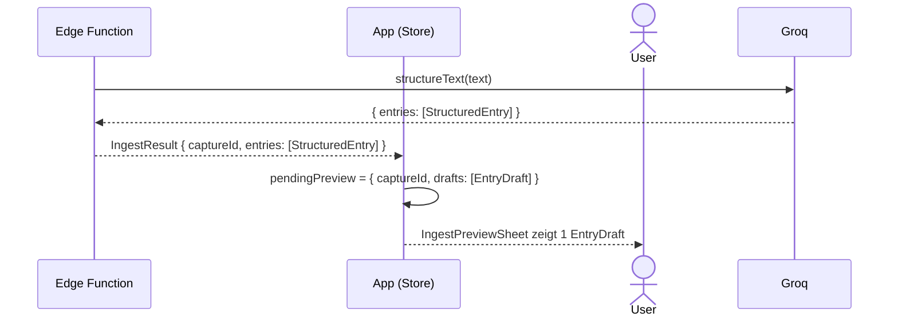

# Dump-Flow A — 1 StructuredEntry → IngestPreviewSheet

Basis-Fall: Groq gibt genau einen `StructuredEntry` zurück (TASK, EVENT oder NOTE).

Einbettung im [Overview](dump-flow-overview.md): nach `processText`, vor `USER_ACTION`.

**Akteure:**
- **App** — Frontend (BrainDumpStore + React)
- **EdgeFn** — Supabase Edge Function `process-brain-dump`
- **Groq** — LLM (Llama, JSON-Mode)
- **User** — Browser

## Referenzen

| Name im Diagramm | Funktion / Datei | Pfad |
| :--- | :--- | :--- |
| `structureText` | Groq-Aufruf + JSON-Parsing | `supabase/functions/process-brain-dump/structureText.ts` |
| `IngestResult` | Rückgabetyp der Edge Function | `src/features/braindump/types/BrainDump.ts` |
| `EntryDraft` | Entwurfstyp vor DB-Insert | `src/features/braindump/types/BrainDump.ts` |
| `pendingPreview` | Store-State: aktive IngestPreview | `src/features/braindump/store/BrainDumpStore.ts` |
| `IngestPreviewSheet` | Bottom Sheet mit EntryDraft-Karten | `src/features/braindump/views/IngestPreviewSheet.tsx` |
