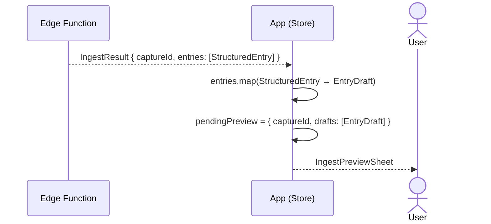

# Dump-Flow A — 1 StructuredEntry → IngestPreviewSheet

Scope: EdgeFn-Antwort bis `IngestPreviewSheet` erscheint.
Eingabe und KI-Verarbeitung → [Übersicht](dump-flow-overview.md).
confirm / discard → [Übersicht](dump-flow-overview.md).

**Hinweis:** `captureId` ist eine UUID, die alle Entries eines Dumps zusammenhält —
bei Flow A gibt es genau einen `EntryDraft` darunter.

## Referenzen

| Name im Diagramm | Funktion / Datei | Pfad |
| :--- | :--- | :--- |
| Edge Function | `IngestResult` produzieren via Groq | `supabase/functions/process-brain-dump/index.ts` |
| `submitText` | Mapping `StructuredEntry → EntryDraft`, `pendingPreview` setzen | `src/features/braindump/store/BrainDumpStore.ts` |
| `IngestPreviewSheet` | Zeigt `pendingPreview.drafts` als Entwurfskarten | `src/features/braindump/views/IngestPreviewSheet.tsx` |
