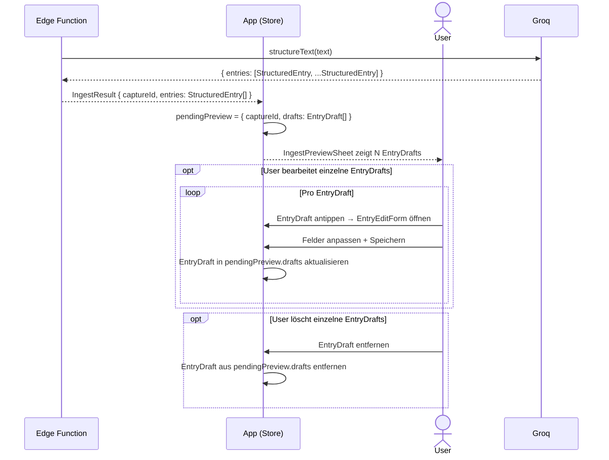

# Dump-Flow B — N StructuredEntrys → IngestPreviewSheet

Groq gibt mehrere `StructuredEntry`s zurück — alle unter derselben `captureId`.
Der User kann `EntryDraft`s im `IngestPreviewSheet` einzeln bearbeiten oder löschen.

Einbettung im [Overview](dump-flow-overview.md): nach `processText`, vor `USER_ACTION`.

**Akteure:**
- **App** — Frontend (BrainDumpStore + React)
- **EdgeFn** — Supabase Edge Function `process-brain-dump`
- **Groq** — LLM (Llama, JSON-Mode)
- **User** — Browser

**Hinweis:** `insertEntries` in `confirmIngest` schreibt alle verbleibenden
`EntryDraft`s als Batch — kein N-maliges Einzelschreiben.

## Referenzen

| Name im Diagramm | Funktion / Datei | Pfad |
| :--- | :--- | :--- |
| `EntryEditForm` | Bearbeitungsformular pro `EntryDraft` | `src/features/braindump/views/EntryEditForm.tsx` |
