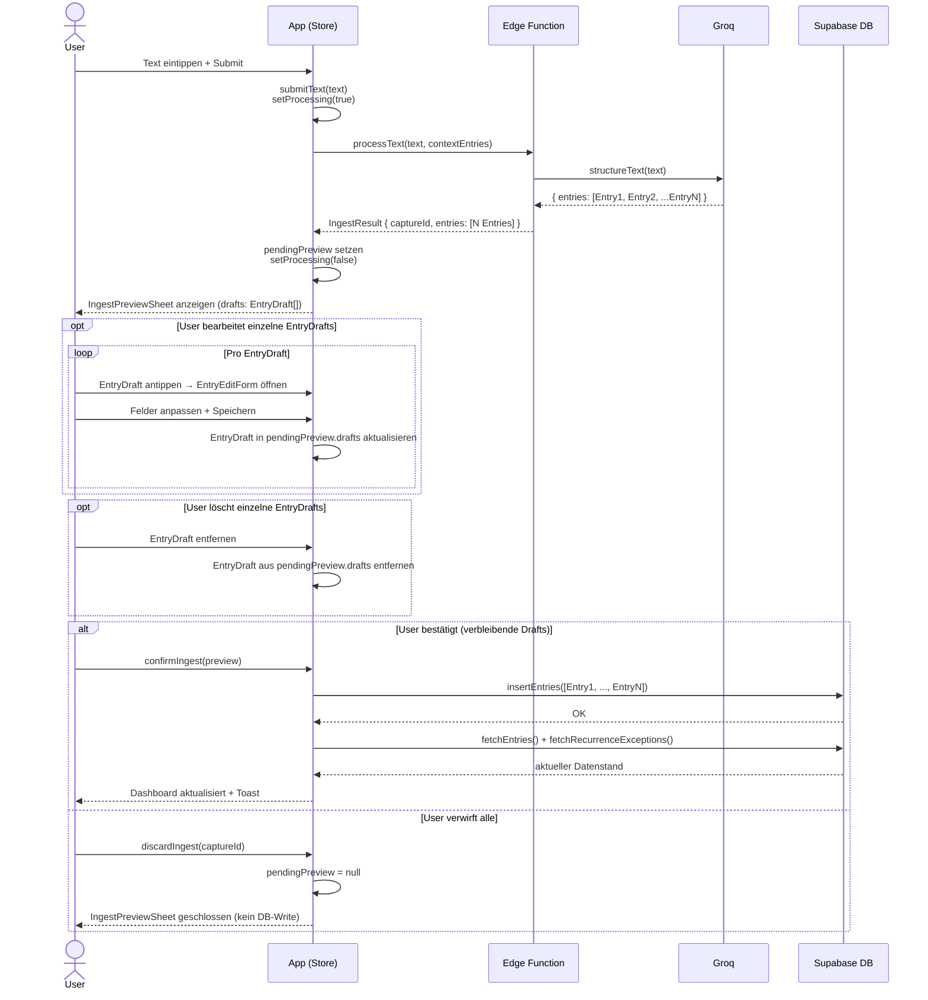

# Dump-Flow B — Text → mehrere Entries → Confirm

Ein Dump enthält mehrere unabhängige Informationen — der LLM gibt N Entries zurück,
die im Preview als separate Karten erscheinen. User kann jeden Draft einzeln bearbeiten
oder löschen, bevor er bestätigt.

Unterschied zu Flow A: EdgeFn liefert `entries: [Entry1, ..., EntryN]`; `insertEntries`
schreibt alle verbleibenden Drafts in einem Batch; `captureId` verbindet alle N Entries.

**Akteure:**
- **User** — Browser
- **App** — Frontend (BrainDumpStore + React)
- **EdgeFn** — Supabase Edge Function `process-brain-dump`
- **Groq** — LLM (Llama, JSON-Mode)
- **DB** — Supabase PostgreSQL

**Hinweise:**
- Alle N Entries teilen sich dieselbe `captureId` — sie gehören zum selben Dump.
- `insertEntries` ist ein einzelner Batch-Insert, kein N-maliges Einzelschreiben.
- Wenn der User einzelne `EntryDraft`s löscht und dann bestätigt, werden nur die
  verbleibenden `EntryDraft`s in die DB geschrieben.
- Falls nach dem Löschen aller `EntryDraft`s `pendingPreview.drafts` leer ist,
  entspricht das einem vollständigen Verwerfen (kein DB-Write).

## Referenzen

| Name im Diagramm | Funktion / Datei | Pfad |
| :--- | :--- | :--- |
| `submitText` | Store-Action: Text verarbeiten, Preview setzen | `src/features/braindump/store/BrainDumpStore.ts` |
| `processText` | HTTP-Call zur Edge Function | `src/features/braindump/services/processBrainDump.ts` |
| `structureText` | Groq-Aufruf + JSON-Parsing | `supabase/functions/process-brain-dump/structureText.ts` |
| Edge Function | Entry-Verarbeitung via Groq | `supabase/functions/process-brain-dump/index.ts` |
| `IngestPreviewSheet` | Bottom Sheet mit N Draft-Karten | `src/features/braindump/views/IngestPreviewSheet.tsx` |
| `EntryEditForm` | Bearbeitungsformular pro Draft-Karte | `src/features/braindump/views/EntryEditForm.tsx` |
| `confirmIngest` | Store-Action: alle Drafts als Batch in DB schreiben | `src/features/braindump/store/BrainDumpStore.ts` |
| `insertEntries` | Batch-DB-Insert für alle neuen Entries | `src/features/braindump/services/index.ts` |
| `fetchEntries` | Entries nach Save neu laden | `src/features/braindump/services/index.ts` |
| `discardIngest` | Store-Action: Preview verwerfen | `src/features/braindump/store/BrainDumpStore.ts` |
