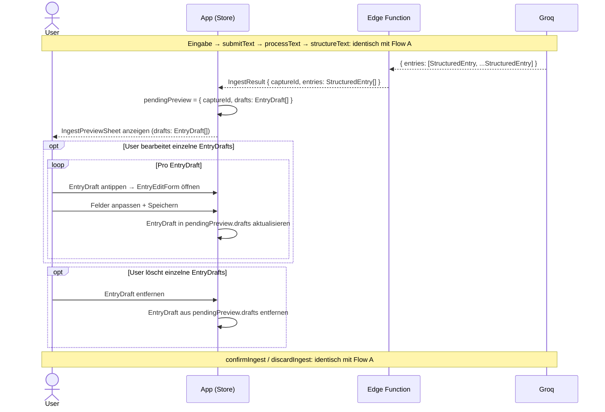

# Dump-Flow B — Text → mehrere Entries → Confirm

Eingabe, KI-Verarbeitung und confirm/discard-Ende sind identisch mit [Flow A](dump-flow-a.md).
Abweichungen beginnen bei der EdgeFn-Antwort: Groq gibt N `StructuredEntry`s zurück statt einem.

**Was hier neu ist gegenüber Flow A:**
- `IngestResult.entries` enthält N `StructuredEntry`s — alle unter derselben `captureId`
- `IngestPreviewSheet` zeigt N `EntryDraft`s, die der User einzeln bearbeiten oder löschen kann
- `insertEntries` schreibt alle verbleibenden `EntryDraft`s als Batch (kein N-maliges Einzelschreiben)

**Hinweis:** Wenn nach dem Löschen `pendingPreview.drafts` leer ist, entspricht
ein anschließendes `confirmIngest` einem No-Op (kein DB-Write).

## Referenzen

| Name im Diagramm | Funktion / Datei | Pfad |
| :--- | :--- | :--- |
| `IngestPreviewSheet` | Bottom Sheet mit `EntryDraft[]` | `src/features/braindump/views/IngestPreviewSheet.tsx` |
| `EntryEditForm` | Bearbeitungsformular pro `EntryDraft` | `src/features/braindump/views/EntryEditForm.tsx` |
| `insertEntries` | Batch-DB-Insert aller verbleibenden `EntryDraft`s | `src/features/braindump/services/index.ts` |
