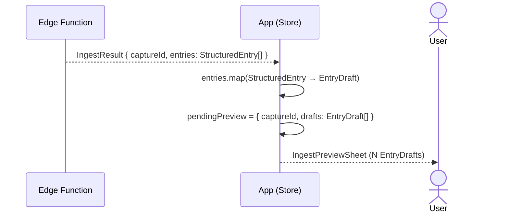

# Dump-Flow B — StructuredEntry[] → IngestPreviewSheet

Scope: EdgeFn-Antwort bis `IngestPreviewSheet` erscheint.
Eingabe und KI-Verarbeitung → [Übersicht](dump-flow-overview.md).
confirm / discard → [Übersicht](dump-flow-overview.md).

Unterschied zu [Flow A](dump-flow-a.md): `IngestResult.entries` enthält N `StructuredEntry`s —
alle unter derselben `captureId`. Das `IngestPreviewSheet` zeigt entsprechend N `EntryDraft`s.

**Hinweis:** Alle N `EntryDraft`s teilen dieselbe `captureId`.
`insertEntries` schreibt sie später als Batch — kein N-maliges Einzelschreiben.

## Referenzen

Neu gegenüber Flow A: keine — Mapping und `pendingPreview`-Logik sind identisch.
