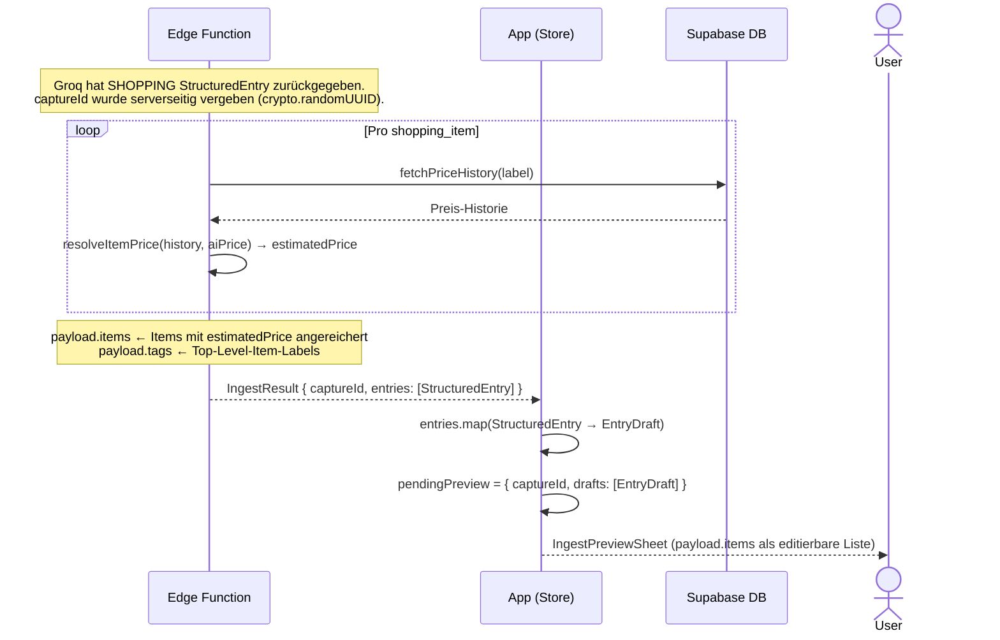

# Dump-Flow C — SHOPPING-Entry → shopping_items → IngestPreviewSheet

Scope: EdgeFn-Antwort bis `IngestPreviewSheet` erscheint.
Eingabe und KI-Verarbeitung → [Übersicht](dump-flow-overview.md).
confirm / discard → [Übersicht](dump-flow-overview.md).

Unterschied zu [Flow A](dump-flow-a.md): Die EdgeFn reichert die Items mit
Preisschätzungen an (Preis-Historie + KI-Preis), schreibt aber **nichts in die DB**.
Items reisen als `payload.items` im `EntryDraft` zum Client. Erst bei `confirmIngest`
werden sie in `shopping_items` geschrieben — nach Bestätigung durch den User.

**Hinweise:**
- `shopping_items` existieren erst in der DB, nachdem `confirmIngest` aufgerufen wurde.
  Wird der Preview verworfen (`discardIngest`), entsteht kein Waisen-Row in der DB.
- Der User kann Items im `IngestPreviewSheet` und im `EntryEditForm` bearbeiten
  (umbenennen, hinzufügen, entfernen) — bevor sie gespeichert werden.
- Items können hierarchisch sein (`parentLabel` / `parent_id`) — Sub-Items werden
  nicht als Tags gesetzt. `insertShoppingItemsFromDraft` löst `parent_id` via
  vorberechneter UUID-Map auf.
- `resolveItemPrice` gewichtet ältere Preis-Historien schwächer als neuere Käufe.

## Referenzen

| Name im Diagramm | Funktion / Datei | Pfad |
| :--- | :--- | :--- |
| `fetchPriceHistory` | Preis-Historie pro Item-Label aus DB lesen | `supabase/functions/_shared/priceHistory.ts` |
| `resolveItemPrice` | KI-Preis + Historie → geschätzten Preis berechnen | `supabase/functions/_shared/priceHistory.ts` |
| `insertShoppingItemsFromDraft` | Items nach Bestätigung in DB schreiben | `src/features/shopping/services/shoppingItemsService.ts` |
| `confirmIngest` | Ruft `insertShoppingItemsFromDraft` auf (nach `insertEntries`) | `src/features/braindump/store/BrainDumpStore.ts` |
| `IngestPreviewSheet` | Zeigt `payload.items` als Items-Liste im SHOPPING-Draft | `src/features/braindump/views/IngestPreviewSheet.tsx` |
| `EntryEditForm` | Items-Sektion für SHOPPING: bearbeiten vor Bestätigung | `src/features/braindump/views/EntryEditForm.tsx` |
