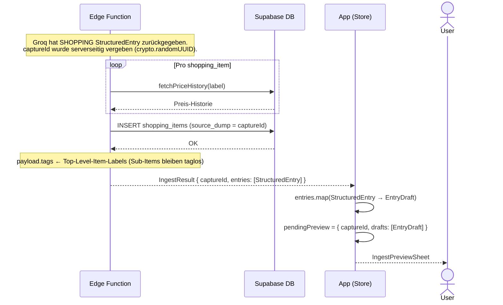

# Dump-Flow C — SHOPPING-Entry → shopping_items → IngestPreviewSheet

Scope: EdgeFn-Antwort bis `IngestPreviewSheet` erscheint.
Eingabe und KI-Verarbeitung → [Übersicht](dump-flow-overview.md).
confirm / discard → [Übersicht](dump-flow-overview.md).

Unterschied zu [Flow A](dump-flow-a.md): Die EdgeFn schreibt `shopping_items` **direkt in die DB**,
bevor sie `IngestResult` zurückgibt. `captureId` verknüpft den späteren `braindump_entries`-Row
mit den bereits existierenden `shopping_items` (via `source_dump`).

**Hinweise:**
- `shopping_items` existieren in der DB bevor `braindump_entries` geschrieben wird.
  Der dazugehörige `braindump_entries`-Row entsteht erst bei `confirmIngest`.
- Items können hierarchisch sein (`parent_id` / `parentLabel`) — Sub-Items werden
  nicht als Tags gesetzt.
- `resolveItemPrice` gewichtet ältere Preis-Historien schwächer als neuere Käufe.

## Referenzen

| Name im Diagramm | Funktion / Datei | Pfad |
| :--- | :--- | :--- |
| `fetchPriceHistory` | Preis-Historie pro Item-Label aus DB lesen | `supabase/functions/_shared/priceHistory.ts` |
| `resolveItemPrice` | KI-Preis + Historie → geschätzten Preis berechnen | `supabase/functions/_shared/priceHistory.ts` |
| `shopping_items` INSERT | Items direkt in DB schreiben (vor IngestResult) | `supabase/functions/process-brain-dump/index.ts` |
| `IngestPreviewSheet` | Zeigt `pendingPreview.drafts` als Entwurfskarten | `src/features/braindump/views/IngestPreviewSheet.tsx` |
