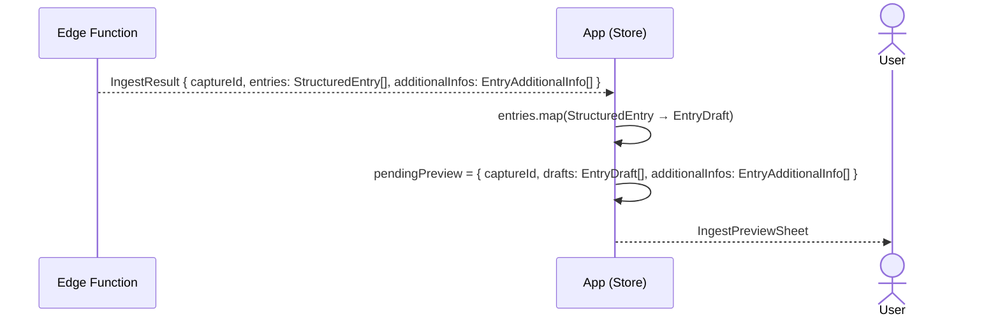

# Dump-Flow D (Mix) — neue Entries + Zusatzinfos → IngestPreviewSheet

Scope: EdgeFn-Antwort bis `IngestPreviewSheet` erscheint.
Eingabe und KI-Verarbeitung → [Übersicht](dump-flow-overview.md).
confirm / discard → [Übersicht](dump-flow-overview.md).

Kombination aus [Flow B](dump-flow-b.md) und [Flow D](dump-flow-d.md):
`IngestResult` enthält sowohl neue `StructuredEntry`s als auch `additionalInfos`
zu bestehenden Entries — beides landet in `pendingPreview`.

**Hinweis:** Im Unterschied zu Flow D (rein) ist `drafts` hier nicht leer —
`IngestPreviewSheet` zeigt neue `EntryDraft`s und die betroffenen bestehenden Entries
gleichzeitig an.

## Referenzen

Keine neuen gegenüber [Flow B](dump-flow-b.md) und [Flow D](dump-flow-d.md).
