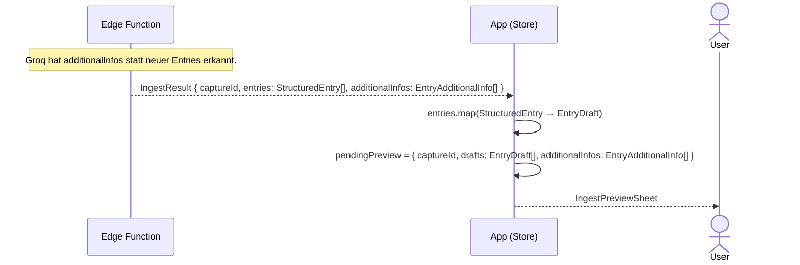

# Dump-Flow D — Zusatzinfo → bestehender Entry → IngestPreviewSheet

Scope: EdgeFn-Antwort bis `IngestPreviewSheet` erscheint.
Eingabe und KI-Verarbeitung → [Übersicht](dump-flow-overview.md).
confirm / discard → [Übersicht](dump-flow-overview.md).

Unterschied zu [Flow A](dump-flow-a.md): Groq erkennt, dass der Dump keine eigenständigen
neuen Entries enthält, sondern Zusatzinfos zu bestehenden Entries (`contextEntries`).
`IngestResult` enthält `additionalInfos: EntryAdditionalInfo[]`. Kein DB-Write in der EdgeFn —
die Zusatzinfos werden erst bei `confirmIngest` in die `summary` der Ziel-Entries geschrieben.

**Hinweise:**
- `EntryAdditionalInfo = { targetEntryId: string, content: string }` — kein neuer Entry,
  sondern ein Stichpunkt, der an die `summary` eines bestehenden Entries angehängt wird.
- Die EdgeFn schreibt **nichts** in die DB — `additionalInfos` werden im `pendingPreview`
  zwischengespeichert und erst bei `confirmIngest` via `updateEntryApi` gespeichert.
- `entries` kann weiterhin neue `StructuredEntry`s enthalten (Mix-Fall aus der Übersicht).
  Der reine Flow-D-Fall hat `entries: []`.

## Referenzen

| Name im Diagramm | Funktion / Datei | Pfad |
| :--- | :--- | :--- |
| `EntryAdditionalInfo` | Typ: `{ targetEntryId, content }` | `src/features/braindump/types/BrainDump.ts` |
| `confirmIngest` | Schreibt `additionalInfos` via `updateEntryApi` in bestehende Entries | `src/features/braindump/store/BrainDumpStore.ts` |
| `updateEntryApi` | DB-Update: `summary` des Ziel-Entries erweitern | `src/features/braindump/services/index.ts` |
