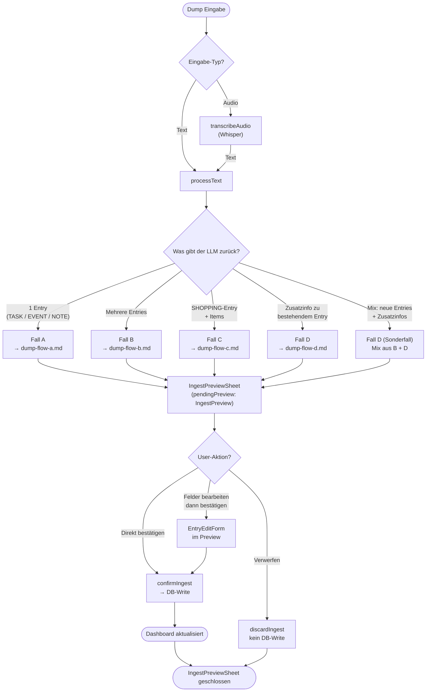

# Dump-Flows — Übersicht aller Fälle

Entscheidungsbaum vom Eintippen/Einsprechen eines Dumps bis zum finalen DB-Write.
Technische Details der einzelnen Flows → jeweilige `dump-flow-*.md`-Dateien.

## Referenzen

| Name im Diagramm | Funktion / Datei | Pfad |
| :--- | :--- | :--- |
| `transcribeAudio` | Audio → Text via Whisper | `src/features/braindump/services/processBrainDump.ts` |
| `processText` | Text an Edge Function schicken | `src/features/braindump/services/processBrainDump.ts` |
| `IngestPreviewSheet` | Bottom Sheet mit Entwurfs-Karten | `src/features/braindump/views/IngestPreviewSheet.tsx` |
| `EntryEditForm` | Bearbeitungsformular im Preview | `src/features/braindump/views/EntryEditForm.tsx` |
| `confirmIngest` | Store-Action: Entwürfe in DB schreiben | `src/features/braindump/store/BrainDumpStore.ts` |
| `discardIngest` | Store-Action: Preview verwerfen | `src/features/braindump/store/BrainDumpStore.ts` |
