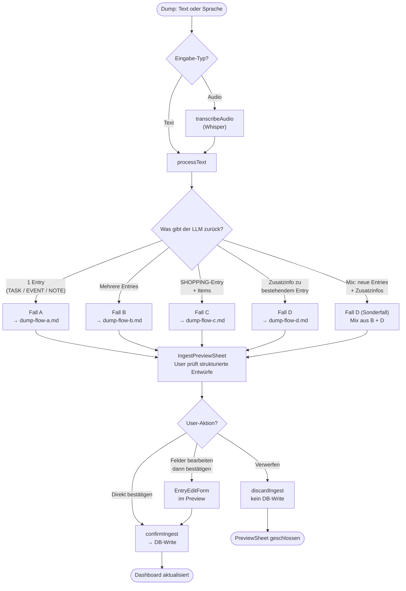

# Dump-Flows — Übersicht aller Fälle

Entscheidungsbaum vom Eintippen/Einsprechen eines Dumps bis zum finalen DB-Write.
Technische Details der einzelnen Flows → jeweilige `dump-flow-*.md`-Dateien.

