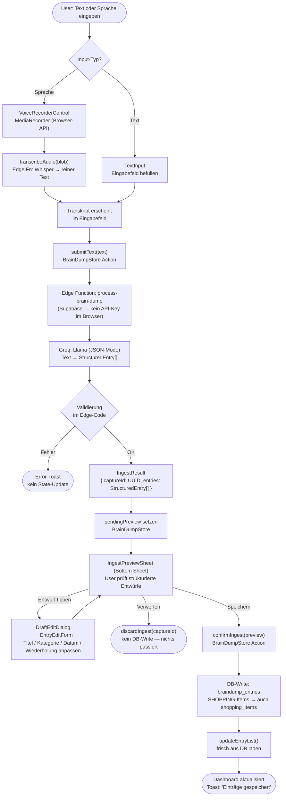
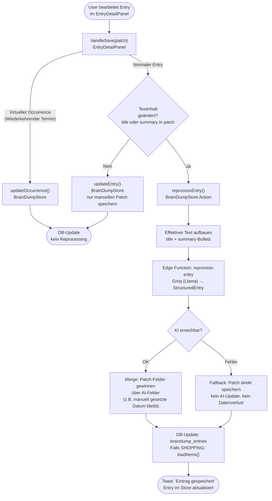

# Ingest-Pipeline (KI-Verarbeitung)

Der Kern-Flow der App: Unstrukturierter Text oder Sprache wird durch zwei KI-Modelle in typsichere Einträge übersetzt und vom User bestätigt, bevor irgendetwas in der Datenbank landet.

## Vollständiger Ablauf



## Reprocessing-Flow (Entry-Bearbeitung)

Wenn ein bereits gespeicherter Entry bearbeitet wird, läuft derselbe KI-Pfad erneut —
aber zielgerichtet für einen einzelnen Entry und ohne Preview-Schritt.



**Merge-Strategie:** Felder, die der User explizit im Patch gesetzt hat, überschreiben
das KI-Ergebnis. Felder, die nicht im Patch sind, werden durch KI aktualisiert
(z.B. Tags, Category, Summary). So gehen manuelle Änderungen (wie ein selbst gesetztes
Datum) nicht durch die KI-Ausgabe verloren.

**SHOPPING-Items:** Wenn der Entry ein SHOPPING-Entry ist, ersetzt die Edge Function
die `shopping_items`-Datensätze serverseitig atomisch (DELETE → INSERT unter demselben
`captureId`). Der Client ruft anschließend `loadItems()` auf, um den Store zu
aktualisieren.

---

## Warum eine Edge Function?

Die KI-Calls (Groq) dürfen **nicht** direkt aus dem Browser erfolgen — der API-Key wäre für jeden sichtbar. Die Edge Function (Supabase) ist das sichere Backend-for-Frontend (BFF): Sie hält den Key in Secrets und ist die einzige Stelle, die mit Groq kommuniziert.

```
Browser ──HTTP──▶ Supabase Edge Fn ──HTTPS──▶ Groq API
                         │
                         └──▶ PostgreSQL (DB-Write nach Validierung)
```

## KI-Input-/Output-Vertrag

Die Edge Function akzeptiert entweder `{ text: string }` (JSON) für Text-Input oder `FormData` mit einer Audio-Datei für Voice-Input. Sie antwortet immer mit:

```typescript
interface IngestResult {
  captureId: string;        // UUID — verbindet alle Entries eines Dumps
  entries: StructuredEntry[];
}

interface StructuredEntry {
  category: 'TASK' | 'EVENT' | 'NOTE' | 'SHOPPING';
  title: string;
  sourceExcerpt: string;    // Relevanter Wortlaut aus dem Original
  summary: string[];        // Stichpunkte
  payload: {
    date?: string;          // YYYY-MM-DD
    startTime?: string;     // HH:MM
    endTime?: string;       // HH:MM
    tags?: string[];
    items?: string[];       // Nur SHOPPING: einzelne Artikel
  };
}
```

Der geteilte Vertrag lebt in `supabase/functions/_shared/contract.ts`.

## Schlüsseldateien

| Datei | Rolle |
| :--- | :--- |
| `src/features/braindump/services/processBrainDump.ts` | `processText()`, `transcribeAudio()`, `reprocessEntryAI()` — HTTP-Calls zur Edge Fn |
| `src/features/braindump/store/BrainDumpStore.ts` | `submitText`, `confirmIngest`, `discardIngest`, `reprocessEntry` — State-Management |
| `src/features/braindump/views/IngestPreviewSheet.tsx` | Bottom Sheet mit Entwurfs-Karten und Bestätigen/Verwerfen |
| `src/features/braindump/views/EntryEditForm.tsx` | Wiederverwendbares Bearbeitungsformular (im Preview und im Detail-Panel) |
| `src/features/braindump/views/EntryDetailPanel.tsx` | Löst `reprocessEntry` beim Speichern aus (nicht-virtuelle Entries) |
| `supabase/functions/process-brain-dump/` | Edge Function: Whisper + Llama, Validierung, SHOPPING-Insert |
| `supabase/functions/reprocess-entry/` | Edge Function: Llama, SHOPPING-Items atomisch ersetzen, ein Entry zurück |
| `supabase/functions/process-brain-dump/structureText.ts` | Gemeinsam genutzt von beiden KI-Functions |
