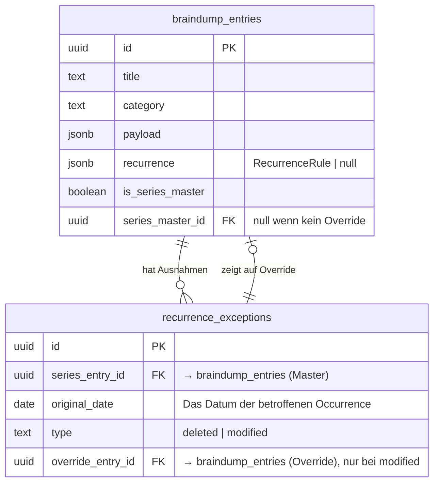
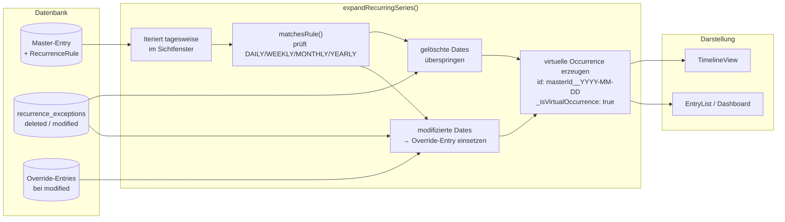
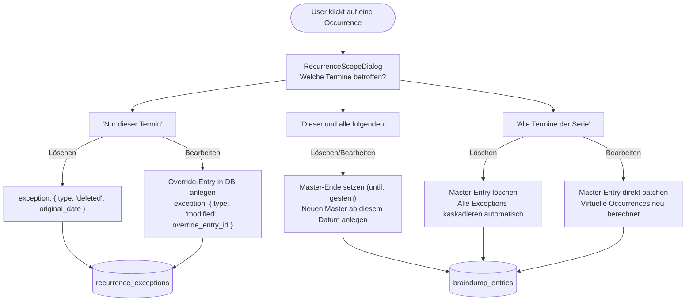

# Termin-Serien (Recurrence-System)

Wiederkehrende Termine funktionieren nach dem **Master + Exceptions**-Muster — dasselbe Modell, das auch Google Calendar und RFC 5545 (iCal) verwenden. In der DB liegt nur ein einziger Master-Eintrag; alle einzelnen Vorkommnisse (Occurrences) werden **client-seitig** berechnet.

## Datenmodell



### RecurrenceRule (TypeScript)

```typescript
type RecurrenceFreq = 'DAILY' | 'WEEKLY' | 'MONTHLY' | 'YEARLY';
type Weekday = 'MO' | 'TU' | 'WE' | 'TH' | 'FR' | 'SA' | 'SU';

interface RecurrenceRule {
  freq: RecurrenceFreq;
  interval: number;            // z.B. 2 = "alle 2 Wochen"
  byDay?: Weekday[];           // nur WEEKLY: welche Wochentage
  byMonthPos?: {               // nur MONTHLY: z.B. "letzter Montag"
    ordinal: 1 | 2 | 3 | 4 | -1;
    day: Weekday;
  };
  end:
    | { type: 'forever' }
    | { type: 'until'; date: string }   // YYYY-MM-DD
    | { type: 'count'; count: number };
}
```

## Expansion (Client-seitig)



**Wichtig:** Virtuelle Occurrences haben keine echte UUID. Ihre ID (`masterId__2026-06-18`) ist niemals in der DB — sie existiert nur im lokalen State. Das bedeutet: Wird eine Occurrence bearbeitet oder gelöscht, muss immer über den **RecurrenceScopeDialog** entschieden werden, was in der DB geändert wird.

## Bearbeiten / Löschen einer Occurrence



## Schlüsseldateien

| Datei | Rolle |
| :--- | :--- |
| `src/features/timeline/expandRecurringSeries.ts` | Reine Funktion: Master + Exceptions → virtuelle Occurrences |
| `src/features/timeline/recurrenceUtils.ts` | `defaultRecurrenceRule()`, `formatRecurrenceShort()` u.a. Helpers |
| `src/features/braindump/views/RecurrencePickerSection.tsx` | UI: Frequenz, Interval, Wochentage, Ende konfigurieren |
| `src/features/braindump/views/RecurrenceScopeDialog.tsx` | UI: Scope-Auswahl beim Bearbeiten/Löschen einer Occurrence |
| `src/features/braindump/types/index.ts` | `RecurrenceRule`, `RecurrenceException`, `RecurrenceScope` Typen |
