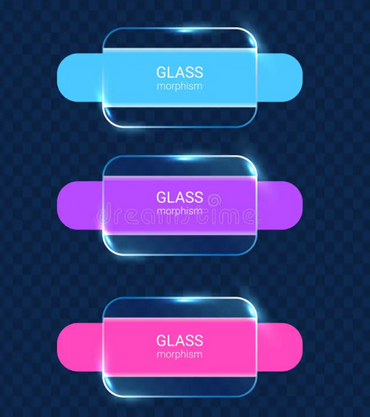

# UI Konzept (Mockups)

Frühe Wireframes und Glassmorphismus-Entwürfe aus der Konzeptphase.

Die daraus abgeleiteten Design-Tokens und Komponenten-Vorgaben sind im [Design Styleguide](./design-styleguide.md) dokumentiert.  
Die aktuelle React-Komponentenstruktur findest du im [Component Tree](./component-tree.md).
